## Presentation

*WhereNext* is a recommendation system designed to optimize the process of filling gaps in biodiversity knowledge. As such, it may help in the process of planning biological surveys, prioritize sampling from a list of preselected sites and even prioritize regions to mobilize data from (e.g. by digitizing local collections). *WhereNext* relies on open biodiversity and environmental data, but also provides users with options to upload their own datasets. Though devised to be run using a graphic interface, *WhereNext* functions may be called directly from the console and integrated into custom data analysis workflows. Besides *WhereNext* recommendations, the intermediate products generated by the app maybe useful in other analysis, such as raw and cleaned occurrences downloaded from GBIF, cropped and masked WorldClim data, cell sampling completeness estimations and the spatial representation of community dissimilarity.

## Background

*WhereNext* is based on generalized dissimilarity modeling (GDM), a statistical method to model and predict spatial patterns of dissimilarity in community composition (Ferrier et al. 2007). In GDM, site-pair community dissimilarity (measured through a dissimilarity index, such as Bray-Curtis or Jaccard) is modeled as a function of the respective differences in environmental variables among sites. This modeling permits estimation of the expected dissimilarity between arbitrary pairs of sites, for example, between surveyed and unsurveyed sites. 

To optimally fill gaps in biodiversity knowledge, *WhereNext* uses the finding by Faith & Walker (1996) that the number of species sampled by a set of sites will be maximized if on average the biological distance from any individual site to its nearest neighbor is as small as possible. Thus, each iteration of the "Recommend Survey" component of *WhereNext*, will find the grid cell that minimizes the biological distance to all already sampled places, in other words, the most complementary. 

## Layout
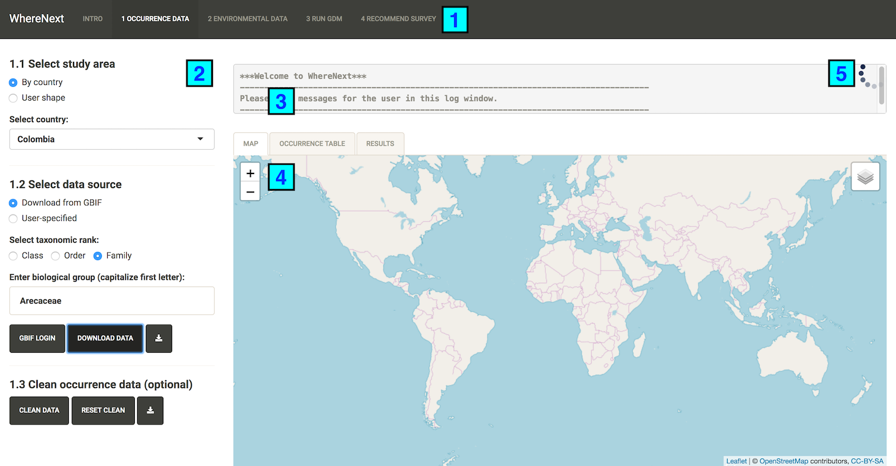{ width=90% }
*WhereNext* layout is divided into five sections. **[1]**. Components, which are major steps in the workflow of the app and are meant to be run in order. **[2]**. Control panel, which consists of modules that also need to be run sequentially, unless they're optional. This is where interaction with the user takes place. **[3]**. Message box, which provides information, warnings and error messages. **[4]**. Results, consisting of three tabs: map (spatial data), occurrence table (biological data), results (component dependent results). **[5]**. Spinning wheel, which indicates R is busy computing results. Credit is due to package *Wallace* (https://wallaceecomod.github.io/) after which *WhereNext* layout is modeled.

Results from all modules may be downloaded by clicking on their respective download button { width=4% }.

## Running an analysis on *WhereNext*
To get started with *WhereNext* we will run an analysis of survey priorities for colombian palms (Arecaceae). To that end we will use open occurrence and environmental data available in GBIF and WorldClim, respectively. Bear in mind that reading large occurrence files into R, such as those available for birds, may cause R to crash if you don't have enough RAM in your system. This applies also to large rasters. In those cases, you can: a) reduce your file size by keeping only the necessary information (essentially unique occurrences by cell, though file formatting rules apply); b) increase the cell size of your analysis and/or c) reduce the extent of your analysis. 

### Component 1: downloading and processing occurrences

The first step in running *WhereNext* is to define your study area. This may be a country, which you can select from the dropdown list, or a customized area, in which case you'd have to select the "User shape option" in module 1.1 to upload a zipped shapefile. Here, we'll select Colombia from the list **[1]**. 

Next, you'll need to select the source of your occurrence data in module 1.2. To download data from GBIF, select  the taxonomic rank **[2]** in which you're interested (class, order or family) and enter the name of your group **[3]**. Here, we'll choose "Family" and enter "Arecaceae" (without quotes, **always** capitalize the first letter) in the text box.

{ width=90% }

Then, click on the GBIF login button **[4]**. You'll need to enter your GBIF username, password and email. If you are not registered on GBIF go to https://www.gbif.org/ to do so. It is preferable that you sign up using the form instead of the quick registration methods (gmail, facebook, github), so that you know all of your credentials. Finally click on the "Download data" button **[5]**.

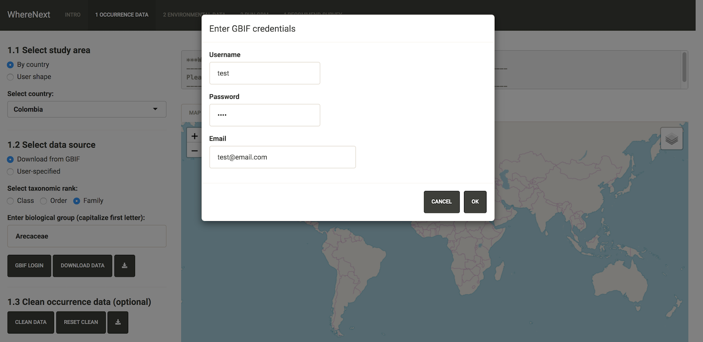{ width=90% }

*WhereNext* will download the requested data from GBIF. This may take a few minutes. You can check on the download progress through the printed output of the R console or by logging into your GBIF profile and accessing your downloads. This is also a way to recover your occurrence data if for some reason the download is interrupted, or if you want to pre-process the data before uploading them manually through the "User-specified" option. 

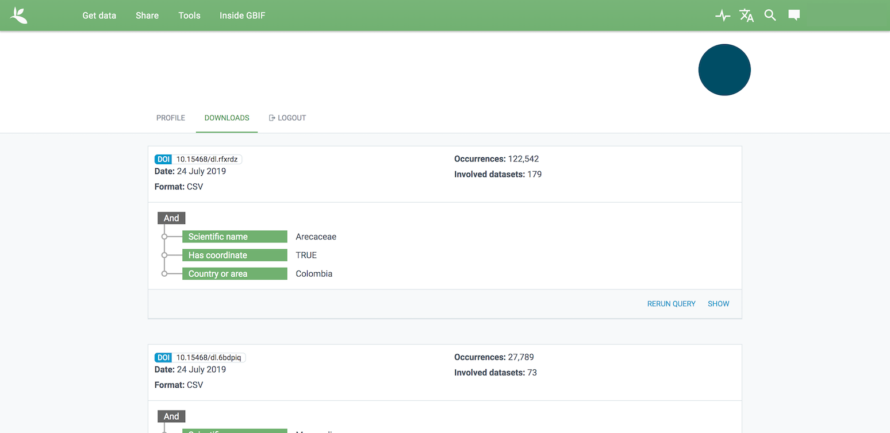{ width=90% }

Once the download is finished, occurrences will be shown in the map and occurrence table tabs, and the citation for your download will be available in the results tab. By clicking on the colored clusters on the map, you may inspect individual occurrences. Further, you can access all record info available in GBIF by clicking on the ID link.

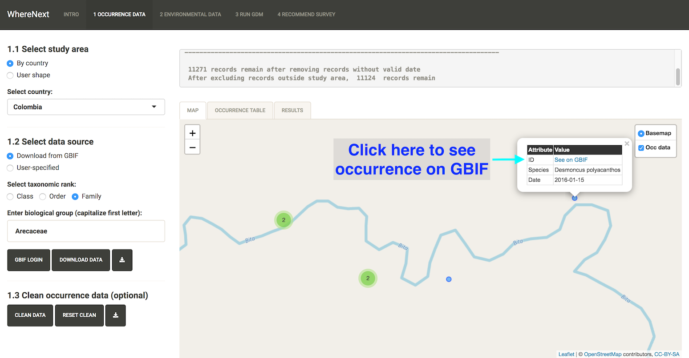{ width=90% }

Importantly, click on the "results" tab to get the citation of your download

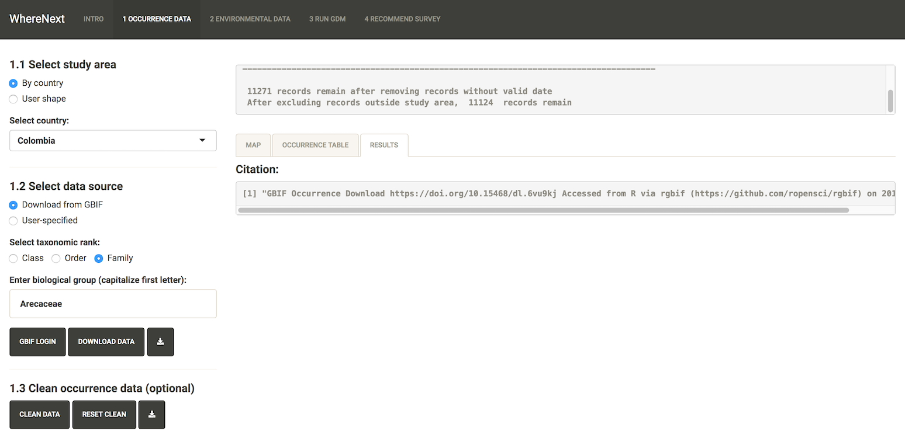{ width=90% }

Finally, you may run the clean data function. This will run `countries`, `capitals`, `centroids`, `equal`, `gbif`, `institutions`, `outliers`, `seas` and `zeros` tests available in CoordinateCleaner. To learn more about these tests check the *CoordinateCleaner* package documentation (https://cran.r-project.org/web/packages/CoordinateCleaner/index.html).

### Component 2: downloading and processing environmental layers

To download data from WorldCLim, all you need to do is to select the resolution of the analysis **[1]**  (2.5 min ~ 5 km, 5 min ~ 10 km, 10 min ~ 20 km), and click on the "Download WorldClim data" button **[2]**. For dense sampling schemes, a higher resolution (e.g. 2.5 min or lower) may be desired. However, for *ad hoc* occurrence data, a lower resolution may be best as it will aggregate more occurrences, thus allowing a better estimation of turnover between cells. Hence, we will choose the 10 min resolution. Notice that you can also upload your own data by selecting the "User-specified" option in module 2.1. In real-world applications, you may want to upload your own set of variables that influence turnover in your occurrence data, such as vegetation and soil layers.

Once the download is completed, you can reduce the redundancy in your environmental data by removing correlated variables. To do so, select a maximum correlation threshold and click on run in module 2.2 **[3]**. The selected variables will be shown on the list of layers to visualize and in the message box. One variable will be plotted in the map tab. You may choose which variable is plotted by selecting it in the "Visualize layer" module **[4]**. 

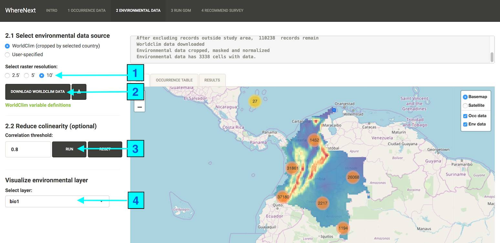{ width=90% }

### Component 3: estimating sampling completeness and running a GDM

We all the necessary inputs to run a GDM, which is the basis to compute the disimilarity from sampled to unsampled sites. However, with occurrece data from *ad hoc* surveys, there's the real danger that some cells in the study area are not sufficiently sampled, thus inducing error in the estimation of disimilarity as a function of environment. The "Estimate cell stats" module, computes the number of species, sampling events (defined by default as days of sampling) and completeness based on the proportion of observed species richness and predicted species richness by the chao2 non-parametric estimator. Click on the run estimation to start this computation **[1]**.

Once is finished, some red circles will be shown on top of the map. They represent cells that have been sampled on at least 2 occassions (the minimum to compute the chao2 estimator). Use the sliders in module 3.2 to explore the consequence of using different criteria and thresholds to cell as "well sampled" **[2]**. You can also look at the values of individual cells by hovering over the red dots on the map or downloading the cell stats file. There are no hard and fast rules to make this decision as it will depend on you study system, sampling methods used etc. For this exercise we will select sites that have been sampled at leat 5 times as our selection criterion. Once that selection has been made, click on the filter occurrences button **[3]**, which will create a subset of occurrences to run the GDM.

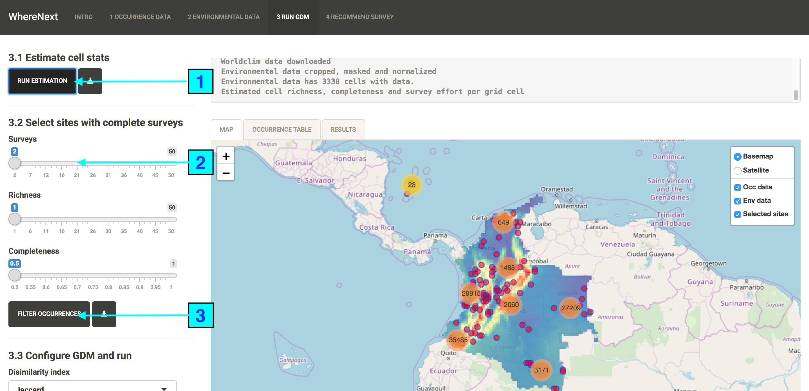{ width=90% }

Now, we're ready to move to the "Configure GDM and run" module. To start this analysis, you will need to select a dissimilarity index from the list. Jaccard and Beta similarity are both recommended for presence-only data, but Beta similarity is richness independent (Lennon et al. 2001), which may be suitable for large areas **[1]**. We will keep the options to include geographic distance as a predictor and perform further variable selection to remove uninformative variables. Click on the "Run GDM" button **[2]**.

A GDM-derived spatial representation of disimilarity will be displayed in the map tab (uncheck the Env Data and Occ Data layers to see it properly). In this depiction of disimilarity, similar colors represent roughly similar biotic communities. For palms, we see a biotic differentiation between the lowlands and Andes highlands, and within the lowlands a distintion between the Caribe and Eastern grasslands, as well as some differentiation between the Amazon and Choco tropical forests . You can further inspect this layer in GIS software by downloading it as a 3-band GeoTIFF file.

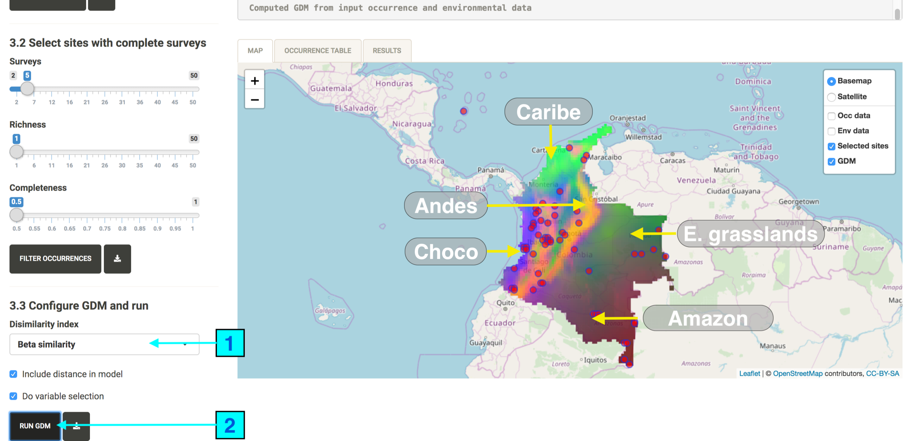{ width=90% }

The results tab provides further info on the variables selected in the model and their coefficients as well as the deviance explained by the model. In this case, deviance explained was 39%, which could be further increasing by incorporating additional variables and/or improving criteria for cell selection.

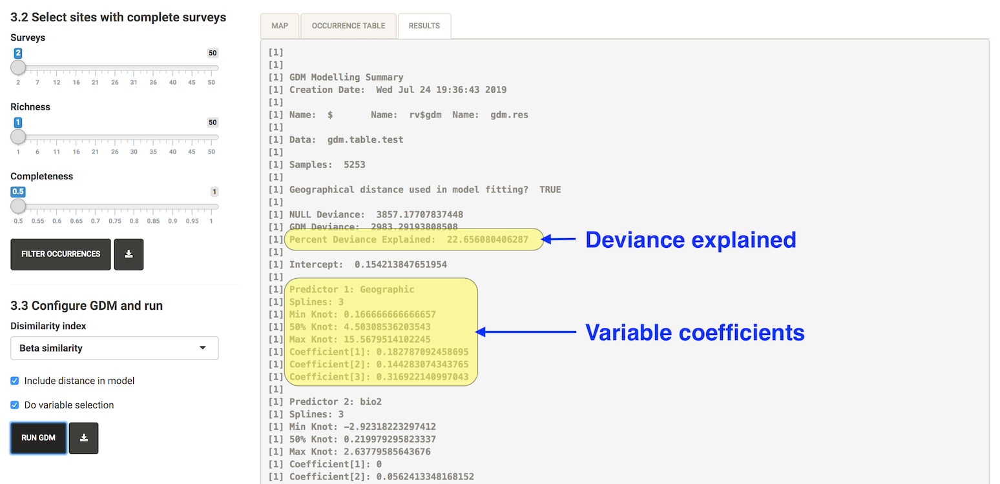{ width=90% }

### Component 4: finding survey suggestions

By default, *WhereNext* suggest sites to sample anywhere in the study area. However, you may constraint the suggestions to a pre-defined list of sites by using the "From preselected sites option". In this case, *WhereNext* will optimize the order in which sites are sampled. To use the "From preselected sites" option, you must upload a two column csv file with headers "decimalLongitude" and "decimalLatitude". 

For palms, we will find suggestions anywhere in the study area. To do so, first click on the "Compute complementarity button" **[1]**. This will add a layer named "Complementarity" to the map (be sure to deactivate layers on top to see it) as well as the first suggestion by *WhereNext* represented by a _light blue dot_. After this, you can proceed iteratively, by selecting an action **[2]** among "add"", "reject", and "modify" and clicking on "go" **[3]**. The decision among actions may be based on their suitability for sampling (e.g. some sites may have visiting restrictions, or be hard to reach, or not have currently suitable vegetation).

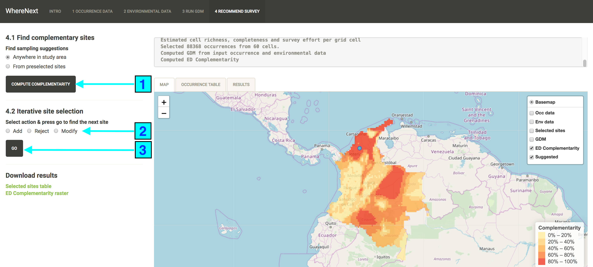{ width=90% }

The modify action allows the user to provide a set of alternative coordinates to replace the suggested site. To do so, select "modify" **[1]**, click on the map to get the coordinates of the desired replacement site **[2]** and click on "go" **[3]** to get the next suggestion.

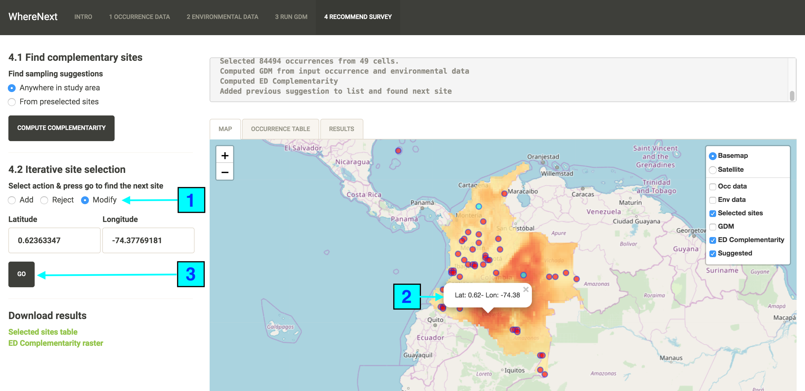{ width=90% }

Finally, you may look at the contribution of additional sites to reduce total complementarity (meaning better sampling coverage) by looking at the plot in the results tab. Once the trend is stable, it may be assummed that additional sites have a low probability of adding species.

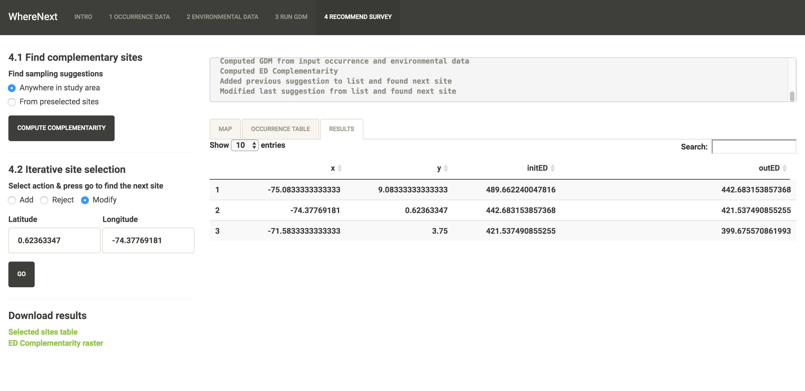{ width=90% }

## Common issues, bug reports and further guidance

  **Errors reading occurrence files**: by default, *WhereNext* assumes plain text files are unquoted and all rows have the same number of fields. When this assumptions are not met, an error may occur. To workaround this issue to may import the problem file into Excel and read it as such into *WhereNext*.

  **Errors with data cleaning**: *WhereNext* relies on package *CoordinateCleaner* to perform some data cleaning procedures. This package in turn relies on *rnaturalearth*, which is under development and causes *CoordinateCleaner* to fail. *WhereNext* will attempt to run *CoordinateCleaner*, but if it fails it will return a warning and print out the error message, without crashing. 

For bug reports, go to https://github.com/jivelasquezt/WhereNext-Pkg/issues.

Additional guidance on *WhereNext* usage may be found in the user guide available on the intro tab. You may further consult individual function help files by typing `help(package="WhereNext")` in R's console. 

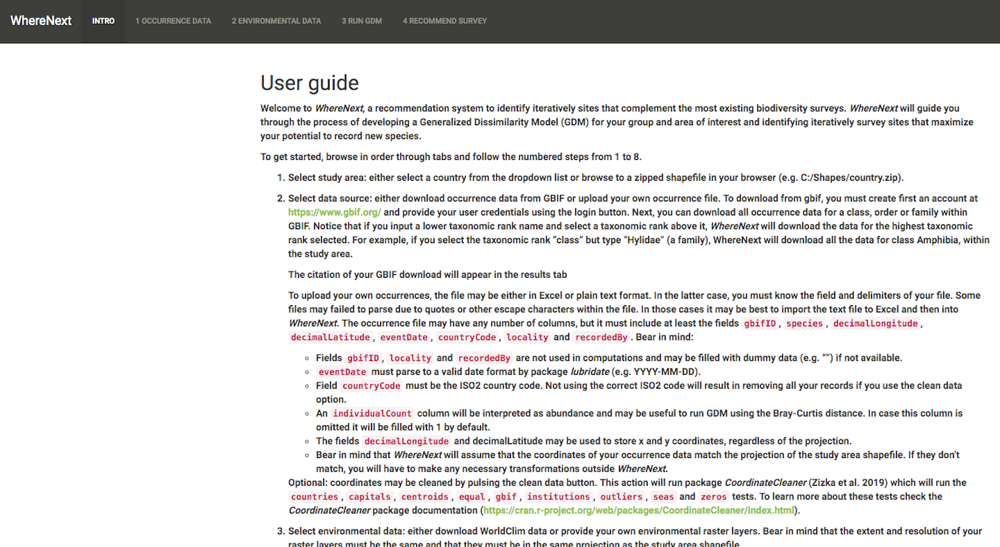{ width=90% }

## References
Ferrier, S., Manion, G., Elith, J., & Richardson, K. (2007). Using generalized dissimilarity modelling to analyse and predict patterns of beta diversity in regional biodiversity assessment. Diversity and distributions, 13(3), 252-264.

Faith, D. P., & Walker, P. A. (1996). Environmental diversity: on the best-possible use of surrogate data for assessing the relative biodiversity of sets of areas. Biodiversity & Conservation, 5(4), 399-415.

Lennon, J. J., Koleff, P., Greenwood, J. J. D., & Gaston, K. J. (2001). The geographical structure of British bird distributions: diversity, spatial turnover and scale. Journal of Animal Ecology, 70(6), 966-979.